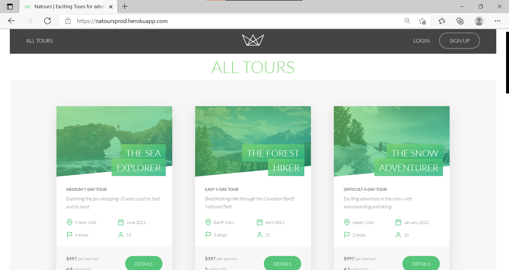
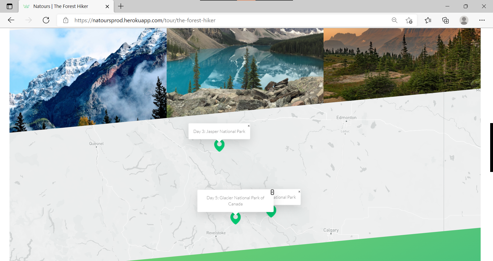
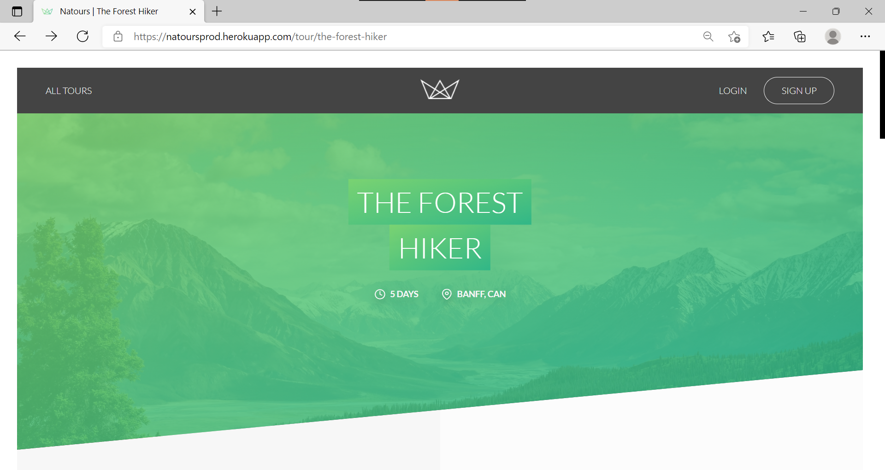

# Natours - An full-stack web application to book tours, meet guides and enjoy a seamless web experience.#
**Deployed on - https://natours-prod.herokuapp.com **

### Images

## A Full Stack CRUD App,
- Supports CRUD operations, like Creating, Reading, Updating and Deleting Entries.
- Follows the Model-View-Controller Model.
- Has multiple routes, admin routes, user authentication using JWT, cookie storage
- Has a payment page as well, using Stripe.
- Used Parcel to bundle front-end files into one .map file for easier and more effective deployment
- Complex State Management
- Beautiful Front-End Interface
- Even dockerized the application to run on any machine, without any errors for a seamless experience
- Fully fledged custom back-end API with sorting, finding and paginating features.

## The API can be accessed on the url/api/v1/...

### Technologies used
1. NodeJS - Runtime Environment
2. MongoDB
3. Express
4. Mongoose - To interact with MongoDB and create the models
5. Node - Mailer - to send Emails
6. Pug Templating
7. Stripe for Payments
8. Mapbox - For the map
9. Parcel - For bundling packages
10. MailTrap and SMTP - For Emails
11. Docker - To dockerize the application
