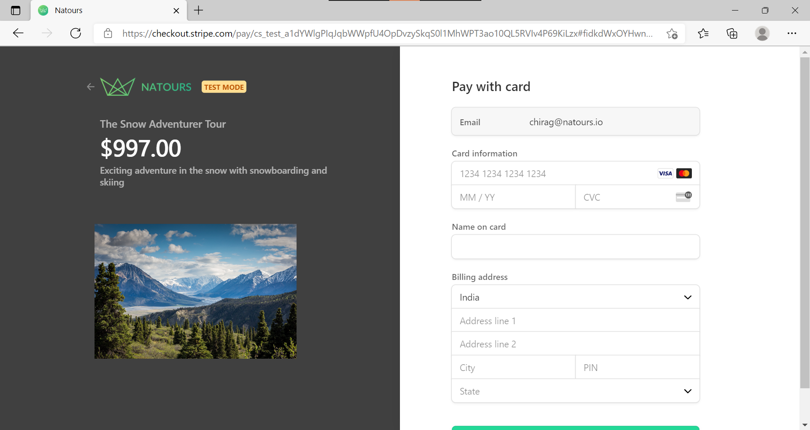

# Natours - An intuitive full-stack web application to book tours, meet guides and enjoy a seamless web experience.#
**Deployed on - https://natours-prod.cyclic.app/**

### Images




## A Full Stack CRUD App,
- Supports CRUD operations, like Creating, Reading, Updating and Deleting Entries.
- Follows the Model-View-Controller Model.
- Has multiple routes, admin routes, user authentication using JWT, cookie storage
- Has a payment page as well, using Stripe.
- Used Parcel to bundle front-end files into one .map file for easier and more effective deployment
- Complex State Management
- Beautiful Front-End Interface
- Even dockerized the application to run on any machine, without any errors for a seamless experience
- Fully fledged custom back-end API with sorting, finding and paginating features.

## The API can be accessed on the url/api/v1/...

### Technologies used
1. NodeJS - Runtime Environment
2. MongoDB Atlas - The NO-SQL database used
3. Express- the main backend framework used
4. JSON Web Tokens - For user authentication
5. Mongoose - To interact with MongoDB and create the models
6. Node - Mailer - to send Emails
7. Pug Templating
8. Stripe for Payments
9. Mapbox - For the map
10. ParcelJS - For bundling packages
11. MailTrap and SMTP - For Emails
12. Docker - To dockerize the application
13. Postman - API testing
14. Cyclic - For deployment

### To just view the application
1. Clone the repository
2. cd into the directory
3. run ```npm i```
4. run ```npm start```

### To edit the application
1. Clone the repository
2. cd into the directory
3. run ```npm i```
4. run ```npm run watch:js``` to start the parcel bundling service
5. run ```npm start```
